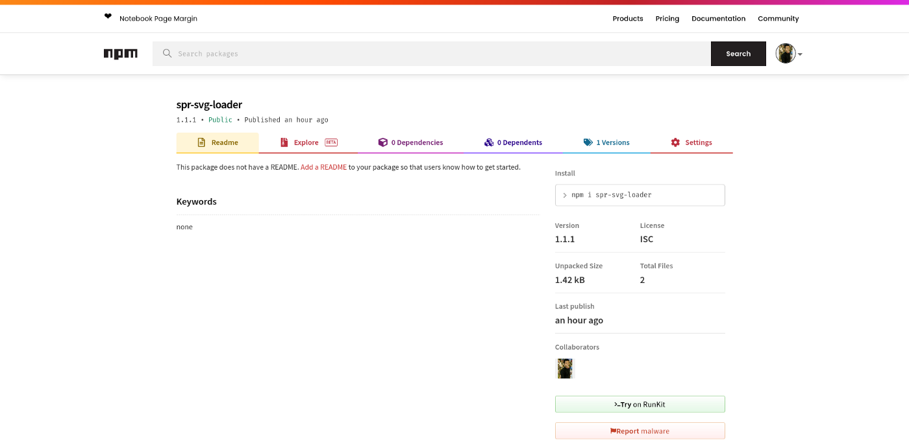

How I get RCE via Dependency Confusion

### 2. Recon 🔦
I started with some Shodan recon and I found a IP that belongs to TARGET. 
Using directory brute forcing tools like [Dirsearch](https://github.com/maurosoria/dirsearch) and [FFUF](https://github.com/ffuf/ffuf), I found a package.json file contained all the packages which was installed in the server. 
URL: /ui/package.json

 &nbsp;

### 3. Dependency Confusion 💡
Using tool called [Confused](https://github.com/visma-prodsec/confused), I found that “spr-svg-loaders” package was not in npm public repository. 
You can verify the same by going to npm website and searching for the package name.

 &nbsp;

### 4. I am Evil 😈
Create a malicious package with the package name and upload it to public npm repository. 
After publishing the package we can verify it with npm repository. 
The full procedure for uploading the package can be found in this [blog](https://dhiyaneshgeek.github.io/web/security/2021/09/04/dependency-confusion/). 

 &nbsp;

### 5. Bounty Time 💵
Within few hours of uploading the packages, I received ping-back with few data like hostname, directory, ipaddress, username to my interact.sh server.
 &nbsp;

another: https://systemweakness.com/rce-via-dependency-confusion-e0ed2a127013
